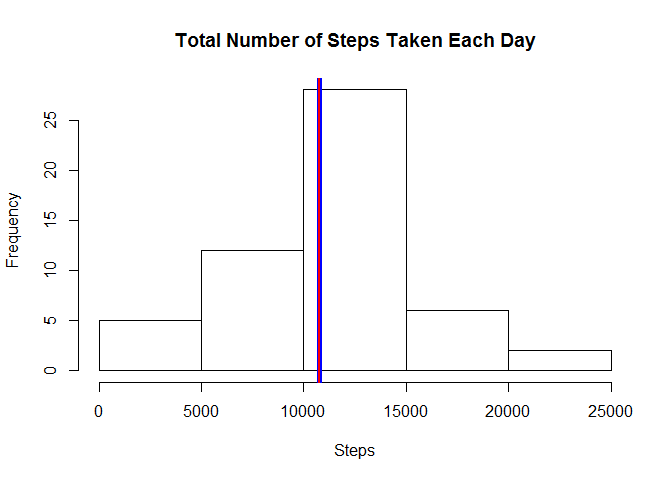
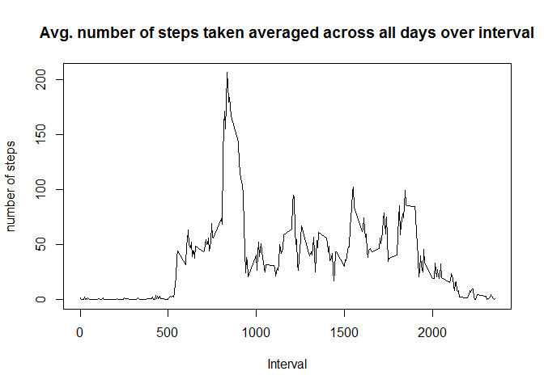
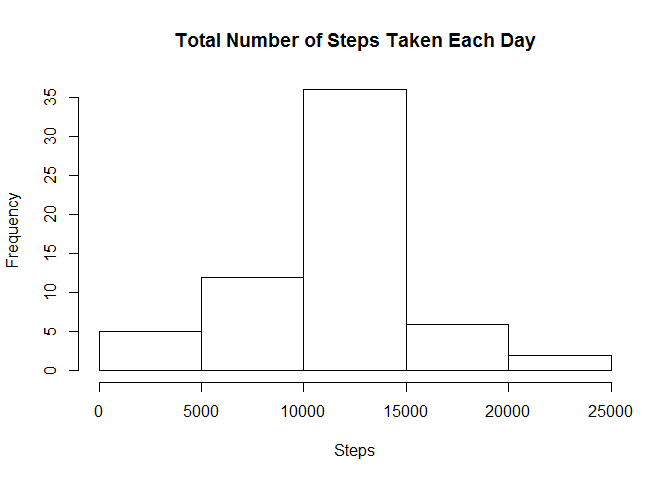
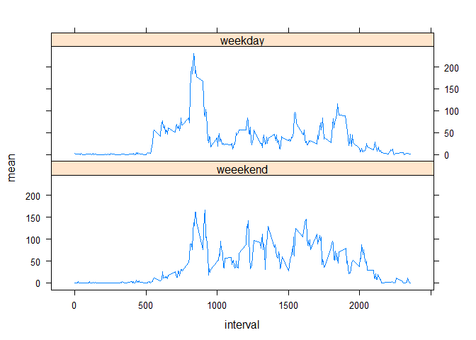

# Reproducible Research: Peer Assessment 1


## Loading and preprocessing the data

```r
library(plyr)
library(lattice)
# Read activity.csv steps data
stepdata =read.csv("activity.csv")
# what data types are they?
str(stepdata)
```

```
## 'data.frame':	17568 obs. of  3 variables:
##  $ steps   : int  NA NA NA NA NA NA NA NA NA NA ...
##  $ date    : Factor w/ 61 levels "2012-10-01","2012-10-02",..: 1 1 1 1 1 1 1 1 1 1 ...
##  $ interval: int  0 5 10 15 20 25 30 35 40 45 ...
```

```r
# convert factor to date in a new data frame called mydata
mydata = data.frame(steps=stepdata$steps, date=as.Date(stepdata$date, format="%Y-%m-%d"), interval=stepdata$interval)
```

## What is mean total number of steps taken per day?

```r
# calculate total number of steps taken per day
stepsday = ddply(mydata, "date", summarize, total=sum(steps))
# Histogram of Total number of Steps taken each day
hist(stepsday$total, xlab="Steps", main="Total Number of Steps Taken Each Day")
# Calculate and report the mean and median of the total number of steps taken per day
abline(v=mean(stepsday$total, na.rm=TRUE), col="blue", lwd=5)
abline(v=median(stepsday$total, na.rm=TRUE), col="red", lwd=2)
```



```r
mean(stepsday$total, na.rm=TRUE)
```

```
## [1] 10766.19
```

```r
median(stepsday$total, na.rm=TRUE)
```

```
## [1] 10765
```

## What is the average daily activity pattern?

```r
# Time series plot of the 5-minute interval(x-axis) and 
# the average number of steps taken, averaged across all days (y-axis)
intervalsteps=ddply(mydata, "interval", summarize, mean=mean(steps, na.rm=TRUE))
plot(intervalsteps$interval, intervalsteps$mean, type="l", xlab="Interval", ylab="number of steps", main="Avg. number of steps taken averaged across all days over interval")
```



```r
# which 5-minute interval, on average across all the days in the dataset, contains max steps? 
intervalsteps[intervalsteps$mean==max(intervalsteps$mean), c("interval")]
```

```
## [1] 835
```
## Imputing missing values

```r
# calculate and report total number of missing values (i.e. total number of rows with NAs) 
sum(is.na(mydata$steps)) 
```

```
## [1] 2304
```

```r
# filling in all missing values in the dataset, e.g. mean/median for that day or mean of that 5min interval
# create new dataset that is equal to the original but with the missing data filled in
fillsteps=function(steps, interval){
  if(is.na(steps))
    return(intervalsteps[interval==intervalsteps$interval, "mean"])
  else
    return(steps)
}
fulldata=adply(mydata, 1, transform, steps=fillsteps(steps,interval))
# histogram of total number of steps taken each day. Report mean and median. 
fulltotal=ddply(fulldata, "date", summarize, total=sum(steps))
hist(fulltotal$total, xlab="Steps", main="Total Number of Steps Taken Each Day")
```



```r
mean(fulltotal$total)
```

```
## [1] 10766.19
```

```r
median(fulltotal$total)
```

```
## [1] 10766.19
```
Do these values differ from the estimates from the first part of the assignment? mean and median is same.
What is the impact of imputing missing data on the estimates of the total daily number of steps?
By imputing missing values, mean and median can be calculated using all observations instead of removing those observations with NA data.  

## Are there differences in activity patterns between weekdays and weekends?

```r
# use weekdays()
# create a new factor variable in the dataset with two levels - weekday and weekend
isweekday=c("Monday", "Tuesday", "Wednesday","Thursday", "Friday")
fulldata$day= ifelse(weekdays(fulldata$date) %in% isweekday, "weekday", "weeekend")
# panel plot containing a time series plot of 5 minute interval (x-axis) 
# and average number of steps taken, averaged across all weekday days or weeekend days (y-axis)
daymeansteps=ddply(fulldata, c("interval","day"), summarize, mean=mean(steps))
xyplot(mean~interval|day, daymeansteps, layout=c(1,2), type="l")
```


